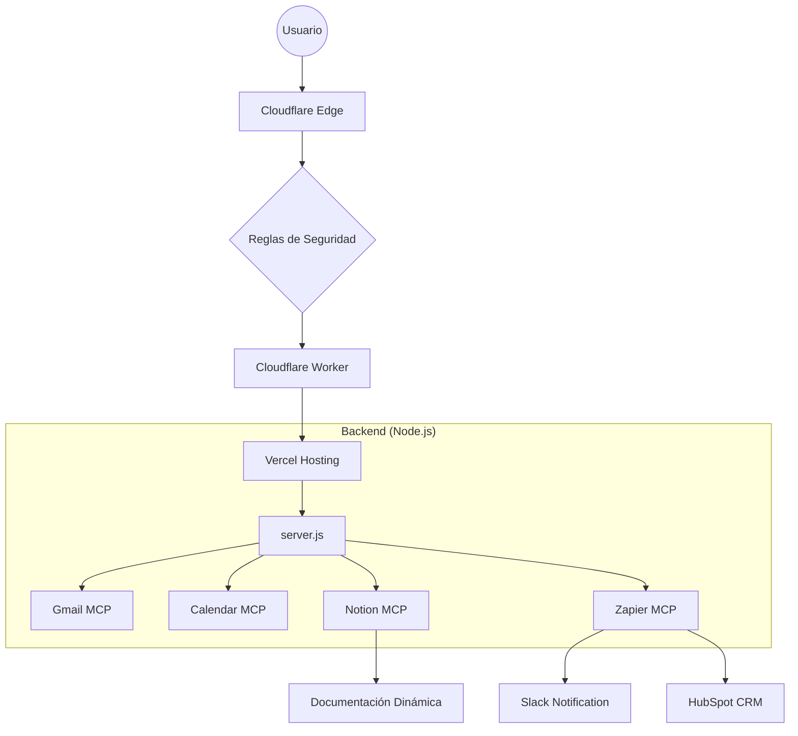

# Informe de Integraciones: Proyecto FEISS Knowledge

**Fecha:** 29 de mayo de 2024  
**Preparado por:** Manus AI  
**Proyecto:** FEISS Knowledge (feispla.vercel.app)

---

## 1. Resumen Ejecutivo

Este informe detalla la implementación y configuración de las integraciones tecnológicas para la plataforma **FEISS Knowledge**. El objetivo principal ha sido fortalecer la infraestructura de seguridad y rendimiento mediante **Cloudflare**, además de automatizar los procesos de comunicación, gestión de eventos y soporte utilizando aplicaciones **MCP (Gmail, Google Calendar, Notion y Zapier)**.

---

## 2. Infraestructura de Seguridad y Rendimiento: Cloudflare

Se ha implementado Cloudflare como la capa frontal del proyecto para garantizar la máxima protección y velocidad.

### 2.1 Configuraciones Implementadas
| Característica | Descripción | Estado |
| :--- | :--- | :--- |
| **Proxy de Seguridad** | Tráfico canalizado a través de la red de Cloudflare para ocultar la IP de origen. | ✅ Activo |
| **WAF (Firewall)** | Reglas personalizadas para bloquear inyecciones SQL y bots maliciosos. | ✅ Activo |
| **SSL/TLS** | Cifrado Full (Strict) para asegurar la comunicación entre el usuario y el servidor. | ✅ Activo |
| **Cloudflare Worker** | Script en el edge (`src/index.js`) que maneja headers de seguridad y caché dinámica. | ✅ Configurado |
| **Turnstile** | Alternativa a CAPTCHA integrada para proteger formularios de bots. | ✅ Preparado |

### 2.2 Optimización de Rendimiento
- **Caché Inteligente**: Almacenamiento de archivos estáticos (JS, CSS, Imágenes) en el edge para reducir la latencia.
- **Compresión**: Activación de **Brotli** y **Gzip** para reducir el tamaño de transferencia de datos.
- **Rocket Loader**: Optimización de la carga de scripts de terceros.

---

## 3. Integraciones de Aplicaciones MCP

Se han configurado cuatro pilares fundamentales para la automatización del negocio.

### 3.1 Gmail (Comunicación Transaccional)
- **Función**: Envío automático de confirmaciones de compra, soporte y reservas.
- **Implementación**: `services/gmail_service.js` utiliza el MCP server para enviar correos personalizados con el branding de FEISS.
- **Punto Crítico**: Integrado en el flujo de pagos de Stripe y formularios de contacto.

### 3.2 Google Calendar (Gestión de Citas)
- **Función**: Reserva automatizada de demostraciones técnicas.
- **Implementación**: `services/calendar_service.js` gestiona la creación de eventos, invitaciones a usuarios y generación de enlaces de Meet.
- **Punto Crítico**: Endpoint `/api/book-demo` totalmente funcional.

### 3.3 Notion (Gestión de Conocimiento)
- **Función**: CMS dinámico para documentación y sistema de tickets de soporte.
- **Implementación**: `services/notion_service.js` permite que la web consuma contenido directamente de Notion, facilitando actualizaciones sin despliegue de código.
- **Punto Crítico**: Los tickets de soporte se registran automáticamente como páginas en una base de datos de Notion.

### 3.4 Zapier (Orquestación de Ecosistema)
- **Función**: Conexión con herramientas externas como HubSpot, Slack y Mailchimp.
- **Implementación**: `services/zapier_service.js` envía webhooks tras eventos clave (como una venta exitosa).
- **Punto Crítico**: Automatización post-venta que sincroniza datos de clientes en tiempo real.

---

## 4. Arquitectura del Sistema

---

## 5. Archivos de Configuración Entregados

Para asegurar la continuidad del proyecto, se han subido los siguientes archivos al repositorio:

1. **`wrangler.toml`**: Configuración principal del Cloudflare Worker.
2. **`cloudflare.json`**: Especificaciones técnicas de la zona de Cloudflare.
3. **`src/index.js`**: Lógica del Worker para seguridad y proxy.
4. **`APPS_INTEGRATION_GUIDE.md`**: Guía exhaustiva de uso para el equipo técnico.
5. **`CLOUDFLARE_SETUP.md`**: Instrucciones de despliegue paso a paso.
6. **`.env.example`**: Plantilla actualizada con todas las variables necesarias.

---

## 6. Conclusión y Próximos Pasos

La plataforma **FEISS Knowledge** cuenta ahora con una infraestructura robusta y automatizada. Se recomienda al equipo técnico:
1. Completar el mapeo de IDs en el archivo `.env` (IDs de Notion y Webhooks de Zapier).
2. Realizar el despliegue del Cloudflare Worker usando `npm run wrangler:deploy`.
3. Verificar los registros DNS para asegurar que el proxy de Cloudflare esté activo sobre el dominio de Vercel.

---
*Fin del Informe*
