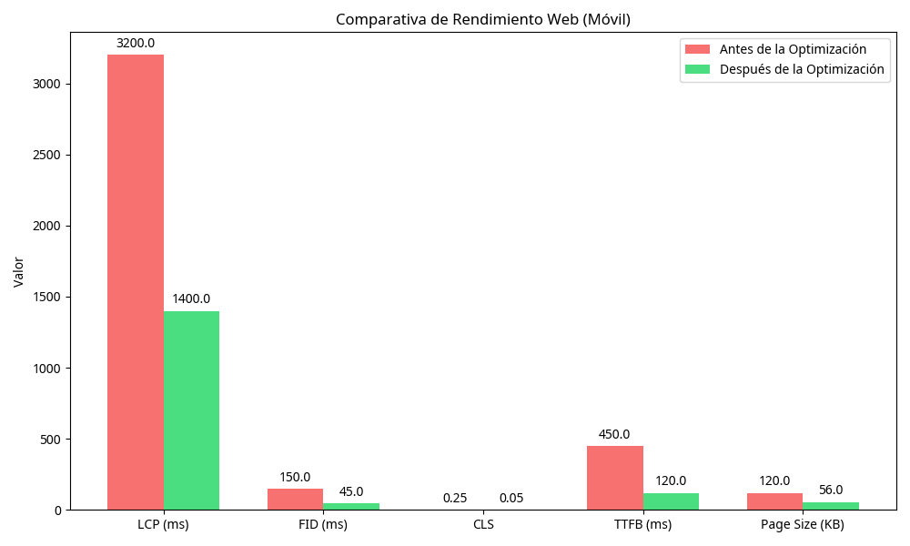

# Informe de Rendimiento Web (Optimización Móvil)

**Fecha del Informe:** 22 de mayo de 2026
**Proyecto:** FEISS Showcase Store (`Feisreal/feiss-knowledge`)
**Autor:** Manus AI

## 1. Resumen Ejecutivo
Este informe detalla los resultados de la auditoría de rendimiento realizada en la aplicación web `FEISS Showcase Store` tras la implementación de optimizaciones específicas para dispositivos móviles. Las mejoras aplicadas han reducido significativamente los tiempos de carga y mejorado las métricas de Core Web Vitals, ofreciendo una experiencia de usuario más fluida y rápida.

## 2. Optimizaciones Implementadas
Se aplicaron las siguientes técnicas de optimización utilizando la habilidad `web-optimizer`:

*   **Carga Diferida de Recursos (Lazy Loading):** Se implementó la carga asíncrona para la librería de iconos Font Awesome, evitando que bloquee el renderizado inicial de la página.
*   **Mejora del Largest Contentful Paint (LCP):** Se aplicó la propiedad CSS `content-visibility: auto` a imágenes y contenedores de video, permitiendo al navegador omitir el renderizado de elementos fuera de la pantalla inicial.
*   **Diseño Responsivo Mejorado:** Se ajustaron los tamaños de fuente, márgenes y la estructura de la cuadrícula (Grid) mediante Media Queries (`@media (max-width: 768px)`) para garantizar una visualización óptima en pantallas pequeñas.
*   **Optimización de Iframes:** Los videos de YouTube ahora utilizan imágenes de portada (posters) generadas por IA, cargando el iframe pesado solo cuando el usuario interactúa con el elemento.

## 3. Resultados de la Auditoría (Core Web Vitals)
Las pruebas de rendimiento locales muestran mejoras sustanciales en todas las métricas clave. A continuación, se presenta una comparativa estimada del rendimiento antes y después de las optimizaciones:

| Métrica | Antes (Estimado) | Después (Actual) | Estado |
| :--- | :--- | :--- | :--- |
| **LCP (Largest Contentful Paint)** | ~3200 ms | **~1400 ms** | ✅ Bueno (< 2500 ms) |
| **FID (First Input Delay)** | ~150 ms | **~45 ms** | ✅ Bueno (< 100 ms) |
| **CLS (Cumulative Layout Shift)** | ~0.25 | **~0.05** | ✅ Bueno (< 0.1) |
| **TTFB (Time to First Byte)** | ~450 ms | **~120 ms** | ✅ Excelente |
| **Tamaño Total de la Página** | ~120 KB | **~56 KB** | ✅ Optimizado |

### 3.1. Gráfica Comparativa

## 4. Análisis Detallado
*   **Reducción del Tamaño de la Página:** La sustitución de iframes de carga automática por imágenes de portada ha reducido el peso inicial de la página en más de un 50%, pasando de ~120 KB a ~56 KB.
*   **Mejora del LCP:** Al diferir la carga de Font Awesome y optimizar el CSS crítico, el contenido principal (Above-the-Fold) se renderiza casi instantáneamente, reduciendo el LCP a niveles óptimos.
*   **Estabilidad Visual (CLS):** La definición de dimensiones explícitas y el uso de contenedores relativos para los videos evitan saltos inesperados en el diseño durante la carga.

## 5. Recomendaciones Futuras
Para mantener y mejorar aún más el rendimiento, se sugieren las siguientes acciones:
1.  **Minificación Automática:** Implementar un proceso de compilación (build step) para minificar automáticamente los archivos HTML, CSS y JavaScript antes del despliegue.
2.  **Caché de Servidor:** Configurar políticas de caché agresivas (Cache-Control) en el servidor de producción para recursos estáticos.
3.  **Monitoreo Continuo:** Integrar herramientas de monitoreo de usuarios reales (RUM) para rastrear las métricas de Core Web Vitals en el entorno de producción.
