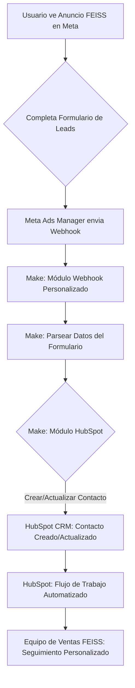

# Diseño del Flujo de Automatización: Meta Ads -> Make -> HubSpot para FEISS

Este documento detalla el diseño técnico para automatizar la captación de leads desde formularios de Meta Ads, su procesamiento a través de Make (anteriormente Integromat) y su posterior gestión en HubSpot CRM para la marca FEISS.

## 1. Objetivo de la Automatización

El objetivo principal es asegurar que cada lead generado a través de los formularios de Meta Ads para periféricos gaming de FEISS sea automáticamente registrado en HubSpot, permitiendo un seguimiento comercial eficiente y personalizado.

## 2. Componentes del Ecosistema

*   **Meta Ads Manager:** Plataforma de publicidad de Meta, donde se crearán los anuncios y los formularios de captación de leads.
*   **Make (Integromat):** Plataforma de automatización que actuará como puente entre Meta Ads y HubSpot. Recibirá los datos del formulario y los transformará/enviará al CRM.
*   **HubSpot CRM:** Sistema de gestión de relaciones con clientes, donde se almacenarán los leads, se les asignará un estado y se iniciarán los flujos de trabajo de seguimiento.

## 3. Flujo de Trabajo Detallado

El proceso se dividirá en tres etapas principales:

### Etapa 1: Captación de Leads en Meta Ads

1.  **Creación del Formulario:** Se utilizará el formulario de leads (Instant Form) en Meta Ads Manager, configurado con las preguntas específicas para los periféricos gaming de FEISS (teclados, auriculares, monitores) y la información de contacto (nombre, email, teléfono, WhatsApp).
2.  **Activación del Webhook:** Meta Ads permite configurar un webhook que se dispara cada vez que un usuario completa un formulario. Este webhook enviará los datos del lead a una URL específica proporcionada por Make.

### Etapa 2: Procesamiento en Make

1.  **Módulo de Webhook (Make):** Make tendrá un módulo de "Webhook personalizado" configurado para escuchar las peticiones POST de Meta Ads. Este módulo recibirá los datos del formulario en formato JSON.
2.  **Parseo de Datos:** Una vez recibidos, los datos JSON serán parseados para extraer la información relevante de cada campo del formulario (nombre, email, teléfono, tipo de periférico, preferencia de juego, etc.).
3.  **Módulo de HubSpot (Make):** Make utilizará su conector de HubSpot para interactuar con el CRM. Aquí es donde se realizará la acción de crear o actualizar un contacto.
    *   **Acción:** "Crear/Actualizar un Contacto" (Create/Update a Contact).
    *   **Mapeo de Campos:** Los datos extraídos del webhook de Meta Ads se mapearán a los campos correspondientes en HubSpot (ej. `email` de Meta Ads a `Email` de HubSpot, `nombre` a `First Name`, etc.).
    *   **Propiedades Personalizadas:** Si se han creado preguntas específicas en el formulario de Meta Ads (ej. "Periférico de interés", "Tipo de juego"), se deberán crear propiedades personalizadas en HubSpot para almacenar esta información y mapearlas correctamente.
4.  **Manejo de Errores:** Se configurarán rutas de error en Make para notificar si la creación del contacto en HubSpot falla, permitiendo una intervención manual si es necesario.

### Etapa 3: Gestión en HubSpot

1.  **Creación/Actualización de Contacto:** Make enviará los datos al MCP de HubSpot, que creará un nuevo contacto si no existe, o actualizará uno existente si el email ya está registrado.
2.  **Asignación de Propiedades:** Las propiedades personalizadas (periférico de interés, tipo de juego) se asignarán al contacto, enriqueciendo su perfil.
3.  **Flujos de Trabajo (Workflows):** En HubSpot, se pueden configurar flujos de trabajo automatizados que se activen cuando un nuevo contacto con ciertas propiedades (ej. "interesado en teclados FEISS") sea creado. Estos flujos pueden:
    *   Enviar un email de bienvenida personalizado.
    *   Asignar el lead a un comercial específico.
    *   Crear una tarea para el equipo de ventas.
    *   Enviar un mensaje de WhatsApp (si hay integración).

## 4. Diagrama de Flujo (Conceptual)

## 5. Consideraciones Técnicas y Requisitos

*   **Token de Acceso de Meta:** Se necesitará un `ACCESS_TOKEN` válido y con los permisos adecuados para la API de Meta Ads Manager. La URL proporcionada `https://graph.facebook.com/v25.0/1620429242367751/events?access_token=ACCESS_TOKEN` es para enviar eventos, no para recibir leads de formularios. Para recibir leads, se configura un webhook en Meta Ads.
*   **Conexión Make-HubSpot:** La conexión se realizará a través del MCP de HubSpot, lo que simplificará la autenticación y el uso de las herramientas de HubSpot.
*   **Propiedades Personalizadas en HubSpot:** Es crucial crear las propiedades personalizadas en HubSpot *antes* de configurar el módulo de Make para asegurar un mapeo correcto de los datos del formulario.
*   **Pruebas:** Realizar pruebas exhaustivas con leads de prueba para verificar que el flujo de datos es correcto en todas las etapas.

Este diseño proporciona una base sólida para la implementación de la automatización. El siguiente paso será verificar las herramientas disponibles en el MCP de HubSpot y detallar la configuración en Make.
